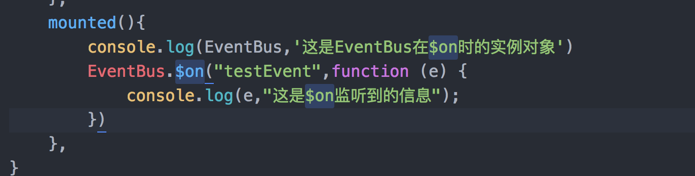
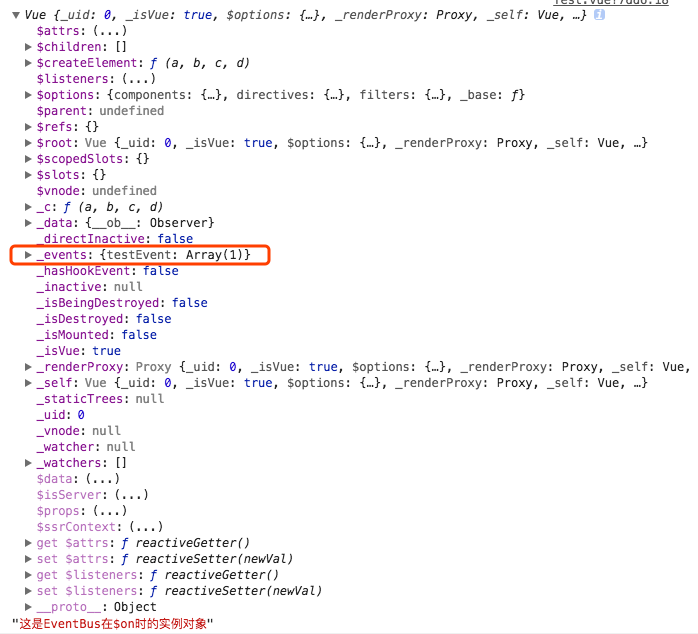
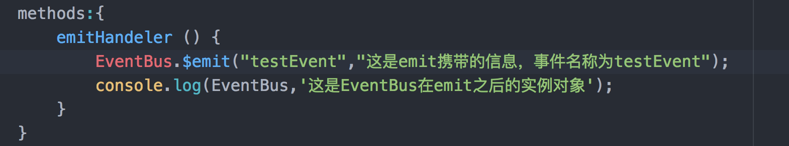
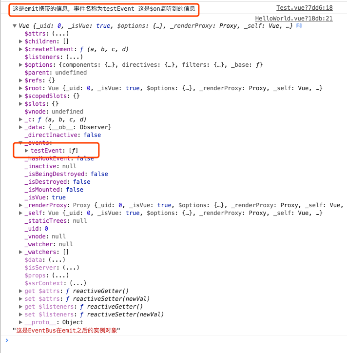

> 声明：本文中提到的**项目**是基于Vue-cli生成的项目demo，vue版本为 ^2.5.2。
>
> 本文中提到的**Vue源码**是[vue-2.5.16](https://github.com/vuejs/vue/archive/v2.5.16.zip)
>
> 本文中提到的**Vuex源码**是[vuex-3.0.1](https://github.com/vuejs/vuex/archive/v3.0.1.zip)

前面我们说到，当我们在用Vue做SPA时，如果项目不是很复杂，一般我们会使用全局事件总线 （global event bus）解决，那么，Vue是怎样实现EventBus的呢？

在vue官方文档中提到，我们会单独实例化一个vue，来作为事件中心，

```
// 将在各处使用该事件中心
// 组件通过它来通信
var eventHub = new Vue()
```

当我们触发事件时，会使用到`$emit` ,其用法是

```
vm.$emit( event, […args] )
参数：
	{string} event
	[...args]
触发当前实例上的事件。附加参数都会传给监听器回调。
```

也就是$emit这个方法接受一个事件名称event,以及若干需要通信的信息。

在Vue源码中`/src/core/instance/events.js` 中，我们看到了`$emit`源码如下：

```js
Vue.prototype.$emit = function (event: string): Component {
    const vm: Component = this
    if (process.env.NODE_ENV !== 'production') {
      const lowerCaseEvent = event.toLowerCase()
      if (lowerCaseEvent !== event && vm._events[lowerCaseEvent]) {
        tip(
          `Event "${lowerCaseEvent}" is emitted in component ` +
          `${formatComponentName(vm)} but the handler is registered for "${event}". ` +
          `Note that HTML attributes are case-insensitive and you cannot use ` +
          `v-on to listen to camelCase events when using in-DOM templates. ` +
          `You should probably use "${hyphenate(event)}" instead of "${event}".`
        )
      }
    }
    let cbs = vm._events[event]
    if (cbs) {
      cbs = cbs.length > 1 ? toArray(cbs) : cbs
      const args = toArray(arguments, 1)
      for (let i = 0, l = cbs.length; i < l; i++) {
        try {
          cbs[i].apply(vm, args)
        } catch (e) {
          handleError(e, vm, `event handler for "${event}"`)
        }
      }
    }
    return vm
  }
```

当我们`$emit`事件的时候，我们看到，`$emit` 函数中会使用我们的eventHub实例，在_events属性上查找有是否注册过`$emit`中的事件，找到之后，会使用for循环依次调用apply方法，触发所有监听过event的事件，并将参数传递过去。

那么，别的组件怎样监听到触发的这些事件呢？别着急，我们接着看`$on`方法。

```
vm.$on( event, callback )
参数：
{string | Array<string>} event (数组只在 2.2.0+ 中支持)
{Function} callback

用法：
监听当前实例上的自定义事件。事件可以由vm.$emit触发。回调函数会接收所有传入事件触发函数的额外参数。
```

在同样的`event.js`文件中，我们看到，

```js
Vue.prototype.$on = function (event: string | Array<string>, fn: Function): Component {
    const vm: Component = this
    if (Array.isArray(event)) {
      for (let i = 0, l = event.length; i < l; i++) {
        this.$on(event[i], fn)
      }
    } else {
      (vm._events[event] || (vm._events[event] = [])).push(fn)
      // optimize hook:event cost by using a boolean flag marked at registration
      // instead of a hash lookup
      if (hookRE.test(event)) {
        vm._hasHookEvent = true
      }
    }
    return vm
  }
```

当我们使用`$on` 监听事件的时候，如果我们监听多个自定义事件，vue会使用循环，在eventHub这个实例对象的`_events`属性中生成一个数组，并将每个事件分别放到`_events`中。这也是为什么当我们`$emit`时，会去循环触发`vm._events[event]` 中的每一个事件，其实就是保证所有注册监听了事件的地方都会得到触发。

此外，当我们想移除监听的自定义事件时，还会用到`$off`方法：

```
vm.$off( [event, callback] )
参数：
{string | Array<string>} event (只在 2.2.2+ 支持数组)
{Function} [callback]

用法：
移除自定义事件监听器。
如果没有提供参数，则移除所有的事件监听器；
如果只提供了事件，则移除该事件所有的监听器；
如果同时提供了事件与回调，则只移除这个回调的监听器。
```

因此，我们看一下源码：

```js
  Vue.prototype.$off = function (event?: string | Array<string>, fn?: Function): Component {
    const vm: Component = this
    // all
    if (!arguments.length) {
      vm._events = Object.create(null)
      return vm
    }
    // array of events
    if (Array.isArray(event)) {
      for (let i = 0, l = event.length; i < l; i++) {
        this.$off(event[i], fn)
      }
      return vm
    }
    // specific event
    const cbs = vm._events[event]
    if (!cbs) {
      return vm
    }
    if (!fn) {
      vm._events[event] = null
      return vm
    }
    if (fn) {
      // specific handler
      let cb
      let i = cbs.length
      while (i--) {
        cb = cbs[i]
        if (cb === fn || cb.fn === fn) {
          cbs.splice(i, 1)
          break
        }
      }
    }
    return vm
  }

```

当没有传参数的时候，会调用`Object.create(null)`方法将`_events`属性制空，也就是清空了所有事件的监听。

当同时提供了事件和回调的时候，如果事件名只有一个，那么会清除对应的事件监听函数` vm._events[event] = null`，如果是多个事件的数组，也就是event是个数组时，会`this.$off(event[i], fn)`递归将其拆分为单个事件来清空。

当只提供了事件监听函数的时候，会循环查找这个函数，然后将其删除。特别的是，循环查找时，使用的while循环的条件是(i—)，这也是性能优化的一个方法，会提高查找效率，比i++效率和性能要好。

除此之外，我们还看到了`$once`这个方法，

```
vm.$once( event, callback )

参数：
{string} event
{Function} callback

用法：
监听一个自定义事件，但是只触发一次，在第一次触发之后移除监听器。
```

看一下它的源码，

```
  Vue.prototype.$once = function (event: string, fn: Function): Component {
    const vm: Component = this
    function on () {
      vm.$off(event, on)
      fn.apply(vm, arguments)
    }
    on.fn = fn
    vm.$on(event, on)
    return vm
  }
```

其实很简单，就是当我们使用`$once`时，其内部定义了一个on方法，会先调用`$off`方法移除掉对用的事件监听，然后调用对应的函数，这样就达到了只触发一次的效果。

总结一下：

对于EventBus来说，其实就是通过实例化一个vue构造函数，获得vue的实例对象，然后将这个实例对象的`_events`属性作为一个挂载点，以自定义的名称作为key，然后这个自定义事件的监听函数作为value，调用`$on`监听的时候，会将这个监听函数放到`_events[event]`对应的数组中去，当调用`$emit`触发时，其实就是找到这个value数组，将其中的函数每个都触发一下。这也是基于回调函数来实现的。

最后，我们在vue项目demo中打印一下这个实例来看一下：

当我们还没有触发`$emit`时，只是使用`$on`监听了自定义事件，我们打印一下这个EventBus实例：



在控制台我们看到：



这也跟我们之前所说的一样，在`$on`阶段，vue已经把这个自定义事件挂在到了这个实例对象的`_events`属性下，这个key就是我们自定义事件的名称，value是对应的监听函数。

接着，我们调用`$emit`方法：





最终我们也看到，我们先出发了`$emit` 后，`$on`监听函数打印出了传递的信息，这也印证了emit中其实就是调用了每一个监听事件。