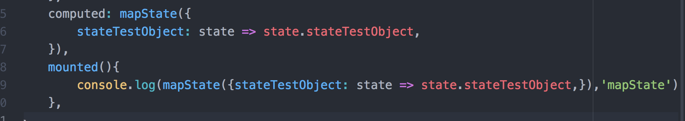
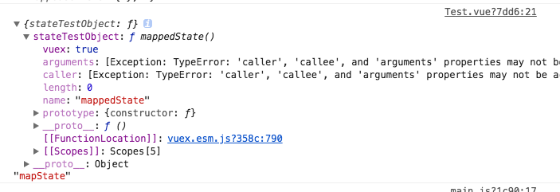

官方提供的API中，还提供了一些组件绑定的辅助函数。

- **mapState(namespace?: string, map: Array<string> | Object): Object**


- **mapGetters(namespace?: string, map: Array<string> | Object): Object**


- **mapActions(namespace?: string, map: Array<string> | Object): Object**


- **mapMutations(namespace?: string, map: Array<string> | Object): Object**


- **createNamespacedHelpers(namespace: string): Object**

在源码`/src/helpers.js`文件中，可以找到这些源码。

**mapState**

先来看看怎么使用：

```
// 在单独构建的版本中辅助函数为 Vuex.mapState
import { mapState } from 'vuex'

export default {
  // ...
  computed: mapState({
    // 箭头函数可使代码更简练
    count: state => state.count,

    // 传字符串参数 'count' 等同于 `state => state.count`
    countAlias: 'count',

    // 为了能够使用 `this` 获取局部状态，必须使用常规函数
    countPlusLocalState (state) {
      return state.count + this.localCount
    }
  })
}
```

当映射的计算属性的名称与 state 的子节点名称相同时，我们也可以给 `mapState` 传一个字符串数组。

```
computed: mapState([
  // 映射 this.count 为 store.state.count
  'count'
])
```

接着看一下源码：

```
export const mapState = normalizeNamespace((namespace, states) => {
  const res = {}
  normalizeMap(states).forEach(({ key, val }) => {
    res[key] = function mappedState () {
      let state = this.$store.state
      let getters = this.$store.getters
      if (namespace) {
        const module = getModuleByNamespace(this.$store, 'mapState', namespace)
        if (!module) {
          return
        }
        state = module.context.state
        getters = module.context.getters
      }
      return typeof val === 'function'
        ? val.call(this, state, getters)
        : state[val]
    }
    // mark vuex getter for devtools
    res[key].vuex = true
  })
  return res
})
```

函数首先对传入的参数调用 normalizeMap 方法，我们来看一下这个函数的定义：

```
function normalizeMap (map) {
  return Array.isArray(map)
    ? map.map(key => ({ key, val: key }))
    : Object.keys(map).map(key => ({ key, val: map[key] }))
}
```

这个方法判断参数 map 是否为数组，如果是数组，则调用数组的 map 方法，把数组的每个元素转换成一个 `{key, val: key}`的对象；否则传入的 map 就是一个对象（从 mapState 的使用场景来看，传入的参数不是数组就是对象），我们调用 Object.keys 方法遍历这个 map 对象的 key，把数组的每个 key 都转换成一个 `{key, val: key}`的对象。最后我们把这个对象数组作为 normalizeMap 的返回值。

回到 mapState 函数，在调用了 normalizeMap 函数后，把传入的 states 转换成由 {key, val} 对象构成的数组，接着调用 forEach 方法遍历这个数组，构造一个新的对象，这个新对象每个元素都返回一个新的函数 mappedState，函数对 val 的类型判断，如果 val 是一个函数，则直接调用这个 val 函数，把当前 store 上的 state 和 getters 作为参数，返回值作为 mappedState 的返回值；否则直接把 `this.$store.state[val]` 作为 mappedState 的返回值。

那么为何 mapState 函数的返回值是这样一个对象呢，因为 mapState 的作用是把全局的 state 和 getters 映射到当前组件的 computed 计算属性中，我们知道在 Vue 中 每个计算属性都是一个函数。

为了更加直观地说明，回到刚才的例子：

```
import { mapState } from 'vuex'
export default {
  // ...
  computed: mapState({
    // 箭头函数可以让代码非常简洁
    count: state => state.count,
    // 传入字符串 'count' 等同于 `state => state.count`
    countAlias: 'count',
    // 想访问局部状态，就必须借助于一个普通函数，函数中使用 `this` 获取局部状态
    countPlusLocalState (state) {
      return state.count + this.localCount
    }
  })
}
```

经过 mapState 函数调用后的结果，如下所示：

```
import { mapState } from 'vuex'
export default {
  // ...
  computed: {
    count() {
      return this.$store.state.count
    },
    countAlias() {
      return this.$store.state['count']
    },
    countPlusLocalState() {
      return this.$store.state.count + this.localCount
    }
  }
}
```

我们再看一下 mapState 参数为数组的例子：

```
computed: mapState([
  // 映射 this.count 到 this.$store.state.count
  'count'
])
```

经过 mapState 函数调用后的结果，如下所示：

```
computed: {
  count() {
    return this.$store.state['count']
  }
}
```

在浏览器打印一下：





#### mapGetters

mapGetters 工具函数会将 store 中的 getter 映射到局部计算属性中。它的功能和 mapState 非常类似，我们来直接看它的实现：

```
export const mapGetters = normalizeNamespace((namespace, getters) => {
  const res = {}
  normalizeMap(getters).forEach(({ key, val }) => {
    val = namespace + val
    res[key] = function mappedGetter () {
      if (namespace && !getModuleByNamespace(this.$store, 'mapGetters', namespace)) {
        return
      }
      if (process.env.NODE_ENV !== 'production' && !(val in this.$store.getters)) {
        console.error(`[vuex] unknown getter: ${val}`)
        return
      }
      return this.$store.getters[val]
    }
    // mark vuex getter for devtools
    res[key].vuex = true
  })
  return res
})
```

mapGetters 的实现也和 mapState 很类似，不同的是它的 val 不能是函数，只能是一个字符串，而且会检查 `val in this.$store.getters` 的值，如果为 false 会输出一条错误日志。为了更直观地理解，我们来看一个简单的例子：

```
import { mapGetters } from 'vuex'
export default {
  // ...
  computed: {
    // 使用对象扩展操作符把 getter 混入到 computed 中
    ...mapGetters([
      'doneTodosCount',
      'anotherGetter',
      // ...
    ])
  }
}
```

经过 mapGetters 函数调用后的结果，如下所示：

```
import { mapGetters } from 'vuex'
export default {
  // ...
  computed: {
    doneTodosCount() {
      return this.$store.getters['doneTodosCount']
    },
    anotherGetter() {
      return this.$store.getters['anotherGetter']
    }
  }
}
```

再看一个参数 mapGetters 参数是对象的例子：

```
computed: mapGetters({
  // 映射 this.doneCount 到 store.getters.doneTodosCount
  doneCount: 'doneTodosCount'
})
```

经过 mapGetters 函数调用后的结果，如下所示：

```
computed: {
  doneCount() {
    return this.$store.getters['doneTodosCount']
  }
}
```

#### mapActions

mapActions 工具函数会将 store 中的 dispatch 方法映射到组件的 methods 中。和 mapState、mapGetters 也类似，只不过它映射的地方不是计算属性，而是组件的 methods 对象上。我们来直接看它的实现：

```
export const mapActions = normalizeNamespace((namespace, actions) => {
  const res = {}
  normalizeMap(actions).forEach(({ key, val }) => {
    res[key] = function mappedAction (...args) {
      let dispatch = this.$store.dispatch
      if (namespace) {
        const module = getModuleByNamespace(this.$store, 'mapActions', namespace)
        if (!module) {
          return
        }
        dispatch = module.context.dispatch
      }
      return typeof val === 'function'
        ? val.apply(this, [dispatch].concat(args))
        : dispatch.apply(this.$store, [val].concat(args))
    }
  })
  return res
})
```

可以看到，函数的实现套路和 mapState、mapGetters 差不多，甚至更简单一些， 实际上就是做了一层函数包装。为了更直观地理解，我们来看一个简单的例子：

```
import { mapActions } from 'vuex'
export default {
  // ...
  methods: {
    ...mapActions([
      'increment' // 映射 this.increment() 到 this.$store.dispatch('increment')
    ]),
    ...mapActions({
      add: 'increment' // 映射 this.add() to this.$store.dispatch('increment')
    })
  }
}
```

经过 mapActions 函数调用后的结果，如下所示：

```
import { mapActions } from 'vuex'
export default {
  // ...
  methods: {
    increment(...args) {
      return this.$store.dispatch.apply(this.$store, ['increment'].concat(args))
    }
    add(...args) {
      return this.$store.dispatch.apply(this.$store, ['increment'].concat(args))
    }
  }
}
```

#### mapMutations

mapMutations 工具函数会将 store 中的 commit 方法映射到组件的 methods 中。和 mapActions 的功能几乎一样，我们来直接看它的实现：

```
export const mapMutations = normalizeNamespace((namespace, mutations) => {
  const res = {}
  normalizeMap(mutations).forEach(({ key, val }) => {
    res[key] = function mappedMutation (...args) {
      let commit = this.$store.commit
      if (namespace) {
        const module = getModuleByNamespace(this.$store, 'mapMutations', namespace)
        if (!module) {
          return
        }
        commit = module.context.commit
      }
      return typeof val === 'function'
        ? val.apply(this, [commit].concat(args))
        : commit.apply(this.$store, [val].concat(args))
    }
  })
  return res
})
```

函数的实现几乎也和 mapActions 一样，唯一差别就是映射的是 store 的 commit 方法。为了更直观地理解，我们来看一个简单的例子：

```
import { mapMutations } from 'vuex'
export default {
  // ...
  methods: {
    ...mapMutations([
      'increment' // 映射 this.increment() 到 this.$store.commit('increment')
    ]),
    ...mapMutations({
      add: 'increment' // 映射 this.add() 到 this.$store.commit('increment')
    })
  }
}
```

经过 mapMutations 函数调用后的结果，如下所示：

```
import { mapActions } from 'vuex'
export default {
  // ...
  methods: {
    increment(...args) {
      return this.$store.commit.apply(this.$store, ['increment'].concat(args))
    }
    add(...args) {
      return this.$store.commit.apply(this.$store, ['increment'].concat(args))
    }
  }
}
```

#### createNamespacedHelpers

创建基于命名空间的组件绑定辅助函数。其返回一个包含 `mapState`、`mapGetters`、`mapActions` 和 `mapMutations` 的对象。它们都已经绑定在了给定的命名空间上。

```
export const createNamespacedHelpers = (namespace) => ({
  mapState: mapState.bind(null, namespace),
  mapGetters: mapGetters.bind(null, namespace),
  mapMutations: mapMutations.bind(null, namespace),
  mapActions: mapActions.bind(null, namespace)
})
```